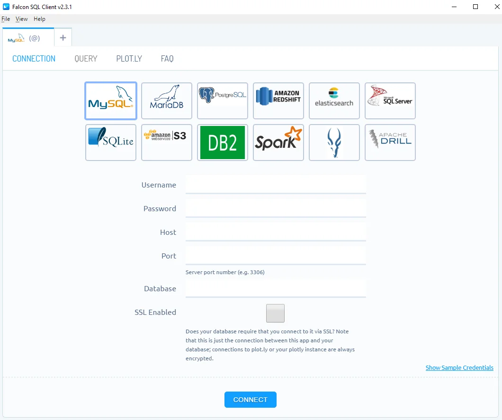

## **Características de Codesandbox**

- Prototipado rápido. Pon a prueba tus ideas, a través de la vista previa.
- Codifica desde cualquier lugar. 
  - Desde cualquier dispositivo. Solamente necesitas un navegador web.
  - Sin configuración. Enfocate directamente en programar, aprovechando sus plantillas.
  - VS Code incorporado. Un editor completo con todas las funciones necesarias.
- Comienza de forma instantánea.
  - Empieza desde una plantilla o directamente desde Github. Plantillas de React, Vue, Angular u otro cualquier soporte.
  - Recarga en caliente y despliega de forma automática. Comprueba los cambios a medida que codificas.
- Crea sitios estáticos, aplicaciones web fullstack o otro tipo de componentes.
  - Explora algunos de los más de 5,343,964 sandboxes diseñados por la comunidad.
- Experimenta fácilmente. Pruebe las cosas para ver cómo funcionan en realidad.
  - Aprenda nuevos frameworks y acostumbrate a comprender su funcionamiento.
  - Evalua los módulos NPM. Para conocer como funcionarán en tu proyecto.
  - Prueba componentes. Creando ejemplos funcionales.
- Comparte con un clic. Cada sandbox ofrece una URL segura y lista para compartir.
  - Comparte fragmentos de código y creaciones con tus amigos, colegas o el mundo.
  - Proporciona informes de errores reproducibles al analizar los problemas desde GitHub.
  - Haz o responde preguntas sobre el código en Stack Overflow o Twitter.

## **1. Un IDE en línea para un rápido desarrollo web**

### Comienza rápidamente
> Usa plantillas para iniciar nuevos proyectos sin configuración

#### Comience desde una plantilla oficial

Tenemos plantillas para todos los marcos populares, desde React, Vue y Angular, hasta Apollo, Gatsby, Next y otros.

#### Puntos de partida creados por la comunidad

Use plantillas hechas por la comunidad. Marque los que le resulten útiles para comenzar con un solo clic.

#### Haz tus propias plantillas

Cree plantillas para su caso de uso específico con la configuración, la estructura de archivos y las dependencias que necesita.

### Úselo con sus herramientas de desarrollo favoritas
> Nos integramos con las herramientas que ya usa para una experiencia de desarrollo perfecta.

#### Integrado con GitHub

Pegue su URL de GitHub y obtenga un sandbox que se sincronice. O exporta tu sandbox a un repositorio de GitHub, crea commits o abre relaciones públicas.

#### Implementar en ZEIT o Netlify

Implemente una versión de producción de su sandbox con ZEIT Now o Netlify.

#### Desarrollado por VS Code

Aproveche el poder y la familiaridad de VS Code. Use "Ir a definición", "Reemplazar ocurrencias" y establezca un tema personalizado.

### Prototipado rápido

#### Soporte NPM
Agregue cualquiera de las dependencias 1M + en npm directamente desde el editor.

#### Recarga de módulo caliente
Con Hot Module Reloading integrado, puede ver los cambios a medida que los realiza.

#### Atajos de teclado y acciones rápidas
Use combinaciones de teclas y acciones rápidas para realizar tareas comunes rápidamente.

#### Enlaces para compartir
Cada sandbox tiene una URL segura con soporte HTTPS para compartir y comentarios.

### Colabora en Code

### Trabaja con Contenedores

### Depura como un profesional

### Administra Sandboxes con facilidad

### Hazlo Tuyo
<!-- https://codesandbox.io/ide -->

## **¿Qué es Falcon?**

Falcon es un editor SQL gratuito de código abierto con visualización de datos en línea. Actualmente es compatible con la conexión a **RedShift**, **MySQL**, **PostgreSQL**, **IBM DB2**, **Impala**, **MS SQL**, **Oracle**, **SQLite** y más (para conectarse a Oracle, consulte [aquí](https://github.com/plotly/falcon-sql-client/blob/master/ORACLE.md){:target="_blank" rel="nofollow,noreferrer"} las instrucciones para instalar el Oracle Instant Client gratuito requerido).

## **Configurar una conexión a sus bases de datos**

En la interfaz de Falcon; podrás configurar una conexión a sus bases de datos. Como puedes ver, hay numerosas bases de datos disponibles. Para obtener una guía más específica, visite el tutorial de su base de datos o visia [la lista completa](https://help.plot.ly/database-connectors/), que incluye [MySQL](https://help.plot.ly/database-connectors/mysql/){:target="_blank" rel="nofollow,noreferrer"}, [MS SQL](https://help.plot.ly/database-connectors/mssql/){:target="_blank" rel="nofollow,noreferrer"}, [PostgreSQL](https://help.plot.ly/database-connectors/postgres/){:target="_blank" rel="nofollow,noreferrer"}, [MariaDB](https://help.plot.ly/database-connectors/mariadb/){:target="_blank" rel="nofollow,noreferrer"}, [Redshift](https://help.plot.ly/database-connectors/redshift/){:target="_blank" rel="nofollow,noreferrer"}, [Apache Drill y archivos de parquet](https://help.plot.ly/database-connectors/apache-drill/){:target="_blank" rel="nofollow,noreferrer"}, [S3](https://help.plot.ly/database-connectors/s3/){:target="_blank" rel="nofollow,noreferrer"}, [Elasticsearch](https://help.plot.ly/database-connectors/elasticsearch/){:target="_blank" rel="nofollow,noreferrer"} o [solicite uno nuevo](https://plotly.typeform.com/to/KUiCSl){:target="_blank" rel="nofollow,noreferrer"} si no ve el qué usted necesita.

[📄 Web de la Documentación de Falcon](https://plotly.com/chart-studio-help/database-connectors/personal-login/ "Documentación Oficial de Falcon"){: .btn .btn--inverse .btn--large .align-center}{:target="_blank" rel="nofollow,noreferrer"}
[⏩ Descargar Falcon para Windows](https://github.com/plotly/falcon/releases/download/v4.1.0/win-falcon-v4.1.0.zip "Descargar el Cliente SQL de Falcon para Windows"){: .btn .btn--inverse .btn--large .align-center}{:target="_blank" rel="nofollow,noreferrer"}
[⏩ Descargar Falcon para MAC](https://github.com/plotly/falcon/releases/download/v4.1.0/mac-falcon-v4.1.0.zip "Descargar el Cliente SQL de Falcon para MAC"){: .btn .btn--inverse .btn--large .align-center}{:target="_blank" rel="nofollow,noreferrer"}
[⏩ Descargar Falcon para Linux](https://github.com/plotly/falcon/releases "Descargar el Cliente SQL de Falcon para Linux"){: .btn .btn--inverse .btn--large .align-center}{:target="_blank" rel="nofollow,noreferrer"}

**Fuente**\: [Github del Proyecto](https://github.com/plotly/falcon "Página del código fuente del proyecto del cliente SQL Falcon en Github") traducci&oacute;n al castellano por [Pablo &Aacute;lvarez Corredera](https://kutt.it/ciberninjast).
{: .notice--info}
