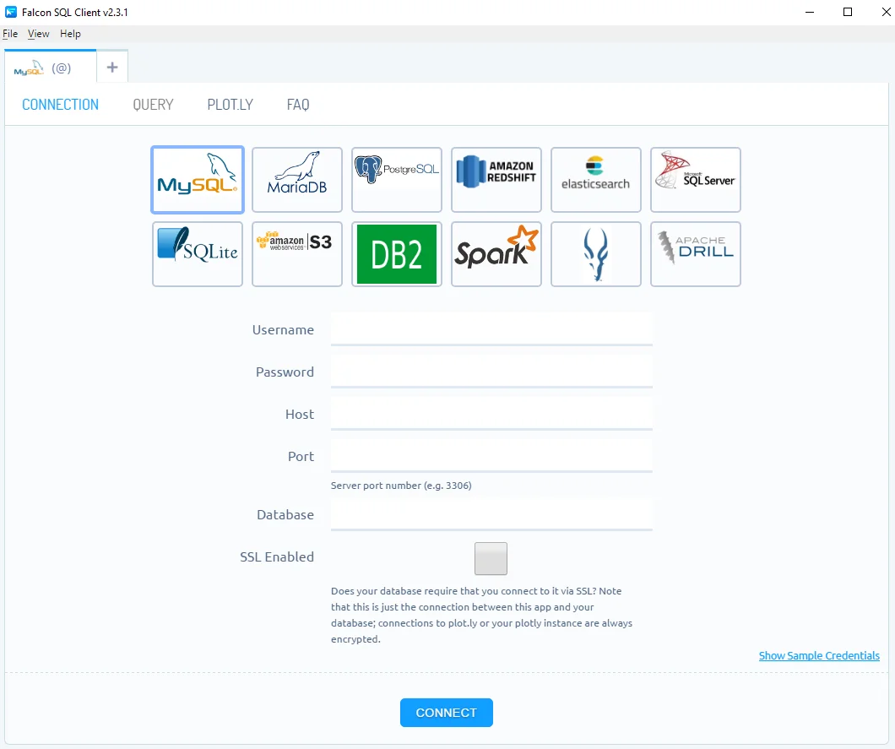

## **¿Qué es Falcon?**

Falcon es un editor SQL gratuito de código abierto con visualización de datos en línea. Actualmente es compatible con la conexión a **RedShift**, **MySQL**, **PostgreSQL**, **IBM DB2**, **Impala**, **MS SQL**, **Oracle**, **SQLite** y más (para conectarse a Oracle, consulte [aquí](https://github.com/plotly/falcon-sql-client/blob/master/ORACLE.md){:target="_blank" rel="nofollow"} las instrucciones para instalar el Oracle Instant Client gratuito requerido).

## **Configurar una conexión a sus bases de datos**

En la interfaz de Falcon; podrás configurar una conexión a sus bases de datos. Como puedes ver, hay numerosas bases de datos disponibles. Para obtener una guía más específica, visite el tutorial de su base de datos o visia [la lista completa](https://help.plot.ly/database-connectors/), que incluye [MySQL](https://help.plot.ly/database-connectors/mysql/){:target="_blank" rel="nofollow"}, [MS SQL](https://help.plot.ly/database-connectors/mssql/){:target="_blank" rel="nofollow"}, [PostgreSQL](https://help.plot.ly/database-connectors/postgres/){:target="_blank" rel="nofollow"}, [MariaDB](https://help.plot.ly/database-connectors/mariadb/){:target="_blank" rel="nofollow"}, [Redshift](https://help.plot.ly/database-connectors/redshift/){:target="_blank" rel="nofollow"}, [Apache Drill y archivos de parquet](https://help.plot.ly/database-connectors/apache-drill/){:target="_blank" rel="nofollow"}, [S3](https://help.plot.ly/database-connectors/s3/){:target="_blank" rel="nofollow"}, [Elasticsearch](https://help.plot.ly/database-connectors/elasticsearch/){:target="_blank" rel="nofollow"} o [solicite uno nuevo](https://plotly.typeform.com/to/KUiCSl){:target="_blank" rel="nofollow"} si no ve el qué usted necesita.

[📄 Web de la Documentación de Falcon](https://plotly.com/chart-studio-help/database-connectors/personal-login/ "Documentación Oficial de Falcon"){: .btn .btn--inverse .btn--large .align-center}{:target="_blank" rel="nofollow"}
[⏩ Descargar Falcon para Windows](https://github.com/plotly/falcon/releases/download/v4.1.0/win-falcon-v4.1.0.zip "Descargar el Cliente SQL de Falcon para Windows"){: .btn .btn--inverse .btn--large .align-center}{:target="_blank" rel="nofollow"}
[⏩ Descargar Falcon para MAC](https://github.com/plotly/falcon/releases/download/v4.1.0/mac-falcon-v4.1.0.zip "Descargar el Cliente SQL de Falcon para MAC"){: .btn .btn--inverse .btn--large .align-center}{:target="_blank" rel="nofollow"}
[⏩ Descargar Falcon para Linux](https://github.com/plotly/falcon/releases "Descargar el Cliente SQL de Falcon para Linux"){: .btn .btn--inverse .btn--large .align-center}{:target="_blank" rel="nofollow"}

**Fuente**\: [Github del Proyecto](https://github.com/plotly/falcon "Página del código fuente del proyecto del cliente SQL Falcon en Github") traducci&oacute;n al castellano por [Pablo &Aacute;lvarez Corredera](https://kutt.it/ciberninjast).
{: .notice--info}
